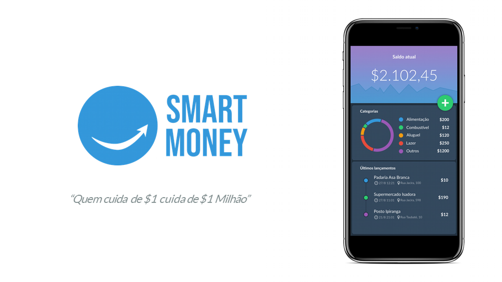
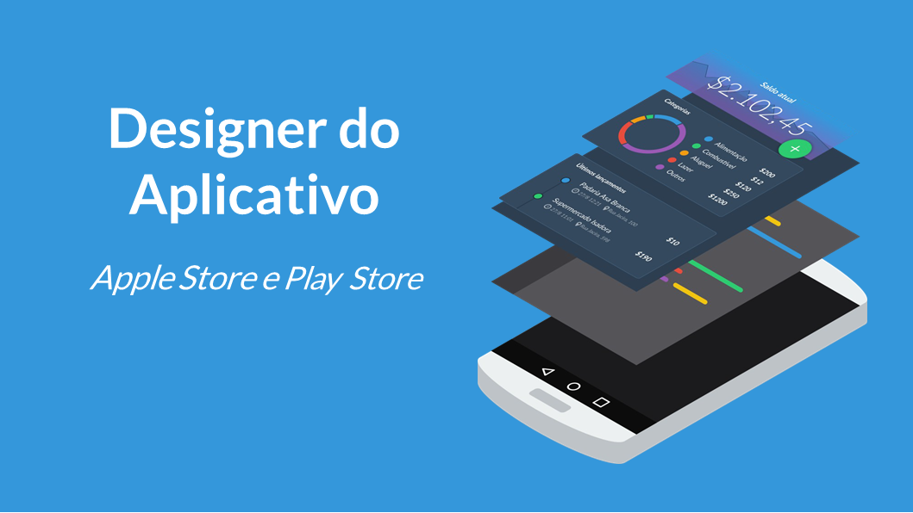
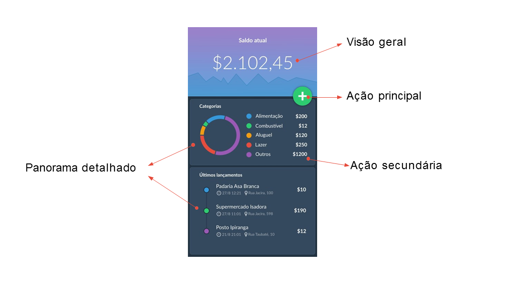
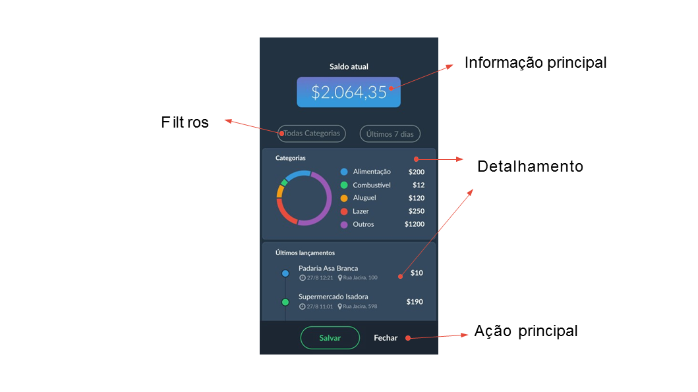
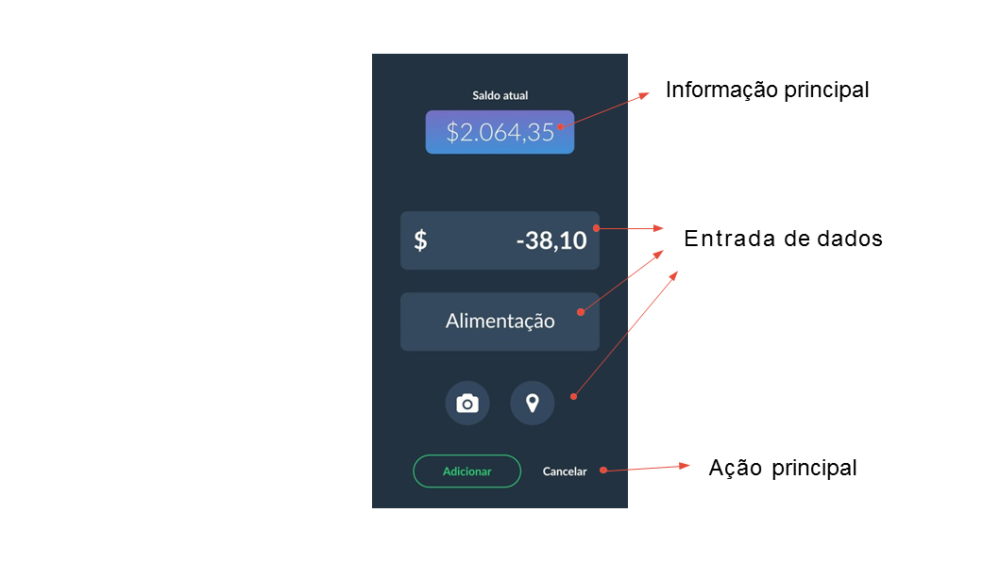
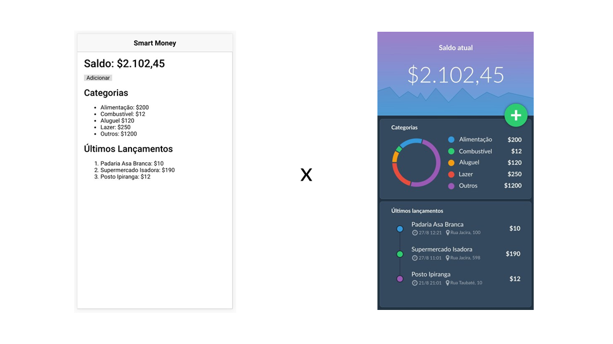
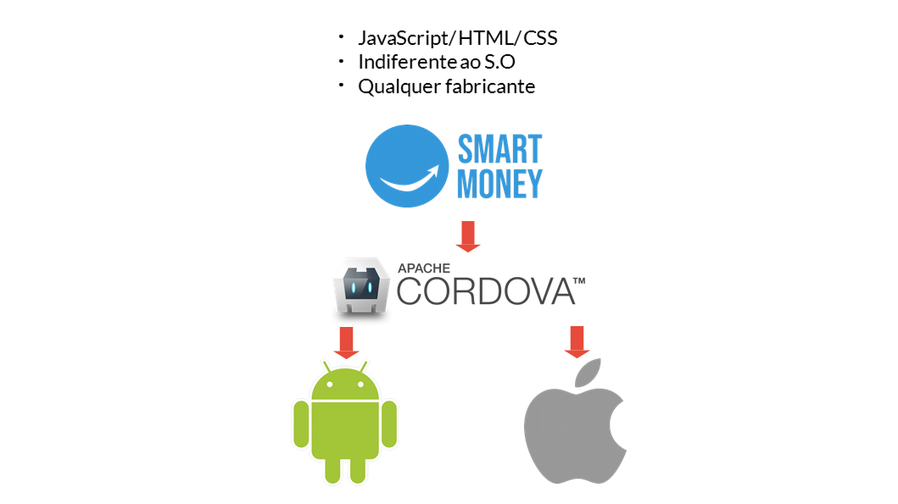
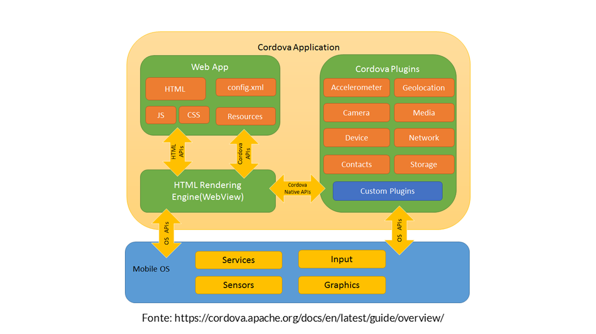

- Alan Almeida

- SantanderTecnologia/TesteIonic: criar um clone do aplicativo da Netflix, se tornou completamente inviável pela falta de tempo no momento. Trabalhando até tarde e aos finais de semana no projeto atual, decidi desenvolver um app que demonstrasse meu conhecimento e que ao mesmo tempo não me tomasse tempo demais.

**Espero que gostem!**

* Planejar o Designer do Aplicativo.
* Gerar relatórios, gráficos e formulários.
* Interagir com a câmera e GPS.
* Salvar informações no banco de dados.
* Criar um pacote APK e enviar para a Play Store.

**Apresentando o Smart Money. Um aplicativo profissional de gerenciamento de finanças pessoais. Para isso iremos utilizar uma tecnologia de ponta, a mesma que eu utilizo para criar meus próprios aplicativos.**

**Importante: com este aplicativo iremos criar telas fantásticas, criar gráficos e elementos profissionais e interagir com os principais dispositivos do seu smartphone.**

**Smart Money**










## Editor

O editor de código que utilizo para construção das minhas apps mobile é o Visual Studio Code da Microsoft. Com ele tenho uma interface muito semelhante aos editores Sublime Text e Atom enquanto mantenho recursos como autocomplete, debugging e outras features presentes apenas em IDE's.

O VSCode não é obrigatório e você pode utilizar o que preferir. Dentre os que eu recomendo estão: VSCode, Sublime Text, Atom e Vim.

Snippets para VSCode: https://code.visualstudio.com/

- [Instalação dos softwares necessários para o aplicativo.]
**Também é necessário para configuração abrir o as propriedades do sistema (variáveis de ambiente), para isso faça:**

- [IMPORTANTE] Por questões de migração de versão do Ionic, instale o Ionic pelo seguinte comando: "npm install ionic@4.8.0 -g​"

1. Abrir o Prompt de Comando
2. Digitar sysdm.cpl SystemProperties

**Na aba Variáveis de Ambiente adicionar (lembre-se que o "=" não faz parte do nome e do conteúdo):**

1. JAVA_HOME=C:\Program Files\Java\jdk1.8.0_181
2. ANDROID_HOME=C:\Android\SDK
3. PATH=%PATH%;%ANDROID_HOME%\tools;%ANDROID_HOME%\platform-tools;%ANDROID_HOME%\tools\bin

# Instalando o driver ADB no Windows

- Para ligar o Smartphone ao Ionic é necessário instalar o Driver ADB no Windows, use o link do artigo: https://www.tecmundo.com.br/android/92890-instalar-drivers-adb-dispositivos-android-windows.htm.

### Windows 

1. Google Chrome: https://www.google.com/intl/pt-BR_ALL/chrome/
2. Visual Studio Code: https://code.visualstudio.com/
3. Java JDK:[Configurando SDK] http://www.oracle.com/technetwork/pt/java/javase/d...
4. Android Studio: https://developer.android.com/studio/
5. NodeJS:[Instalando dependências] https://nodejs.org/

### Linux

1. Google Chrome: https://www.google.com/intl/pt-BR_ALL/chrome/
2. Visual Studio Code: https://code.visualstudio.com/
3. Java JDK:[Configurando SDK] http://www.oracle.com/technetwork/pt/java/javase/d...
4. Android Studio: https://developer.android.com/studio/
5. NodeJS:[Instalando dependências] https://nodejs.org/

### OS X (Mac)

1. Google Chrome: https://www.google.com/intl/pt-BR_ALL/chrome/
2. Visual Studio Code: https://code.visualstudio.com/
3. Java JDK:[Configurando SDK] http://www.oracle.com/technetwork/pt/java/javase/d...
4. Android Studio: https://developer.android.com/studio/
5. NodeJS:[Instalando dependências] https://nodejs.org/

## File Structure of App

```
ionic-smartMoney-app/

```